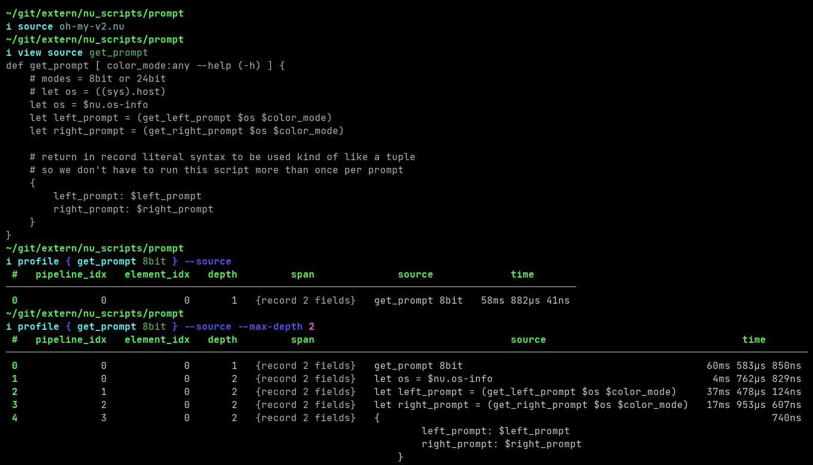
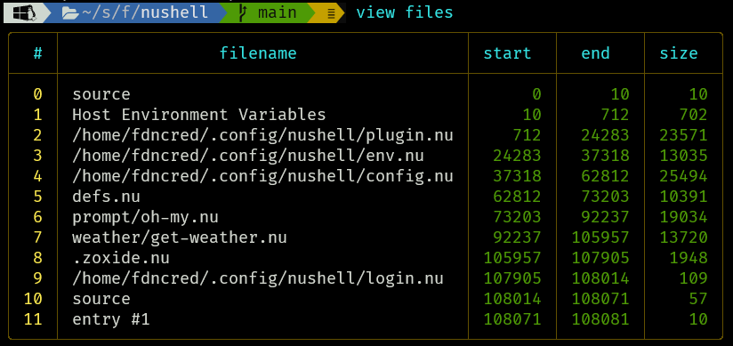

# Nushell 0.76

Nushell, or Nu for short, is a new shell that takes a modern, structured approach to your command line. It works seamlessly with the data from your filesystem, operating system, and a growing number of file formats to make it easy to build powerful command line pipelines.

Today, we're releasing version 0.76 of Nu. This release also contains a good amount of polish and refactoring behind the scenes.

<!-- more -->

# Where to get it

Nu 0.76 is available as [pre-built binaries](https://github.com/nushell/nushell/releases/tag/0.76.0) or from [crates.io](https://crates.io/crates/nu). If you have Rust installed you can install it using `cargo install nu`.

NOTE: The optional dataframe functionality is available by `cargo install nu --features=dataframe`.

As part of this release, we also publish a set of optional plugins you can install and use with Nu. To install, use `cargo install nu_plugin_<plugin name>`.

# Themes of this release / New features

## Debugging

We've added a few new commands to help with nushell debugging.

- `ast` - The `ast` command works the same as before and produces an ast for any pipeline you give it.

- `debug` - The `debug` command works the same as before and produces some output about nushell values.

- `explain` [7957](https://github.com/nushell/nushell/pull/7957)

The explain command attempts to explain to you how the pipeline, in the passed in block, is going to be interpreted. It shows the pipeline and command index, the looked up and found command name, the command argument data type, and argument details, among other things. Note that spans are also included and can be used with `view span`.


- `inspect` [8028](https://github.com/nushell/nushell/pull/8028)

The purpose of the `inspect` command is to help to debug pipelines. It works by allowing you to inject the `inspect` command into a pipeline at any point. Then it shows you what the input description is and what the input values are that are passed into `inspect`. With each step it prints this information out while also passing the value information on to the next step in the pipeline.


- `metadata` - The `metadata` command works the same as before.

- `profile` [7854](https://github.com/nushell/nushell/pull/7854)

Enables fine-grained profiling of individual pipeline elements and recursively stepping into blocks/closures. The recursion depth can be controlled (default is 1) and it can optionally collect the profiled source segments for easier orientation and value in each step for easier debugging.



_Note: There are known limitations that the profiler can't run. For example, it can't collect data from subexpressions and loop iterations. It is caused by profiling data being collected as pipeline metadata and a known bug that pipeline metadata is not preserved in some cases._

- `timeit` (formerly known as benchmark) [8018](https://github.com/nushell/nushell/pull/8018)

```bash
〉timeit { ls | sort-by name type -i | get name }
2ms 509µs 900ns
```

- `view files` [7989](https://github.com/nushell/nushell/pull/7989)

`view files` lists the files and entries loaded into nushell's EngineState memory. Note the spans, for use with `view span` and the size of each file's contents stored.



- `view source` (formerly known as `view-source`) [7989](https://github.com/nushell/nushell/pull/7989)

```bash
〉def my-cmd [arg] { echo $arg }
〉my-cmd hi
hi
〉view source my-cmd
def my-cmd [ arg:any --help (-h) ] { echo $arg }
```

- `view span` [7989](https://github.com/nushell/nushell/pull/7989)

Spans are important to nushell. One of their uses is to show where errors are. For instance, in this example below, the leader lines pointing to parts of the command line are able to point to `10`, `/`, and `"bob"` because each of those items have a span.

```bash
〉10 / "bob"
Error: nu::parser::unsupported_operation (link)

  × Types mismatched for operation.
   ╭─[entry #8:1:1]
 1 │ 10 / "bob"
   · ─┬ ┬ ──┬──
   ·  │ │   ╰── string
   ·  │ ╰── doesn't support these values.
   ·  ╰── int
   ╰────
  help: Change int or string to be the right types and try again.
```

### Example usage:

```bash
〉let a = 42
〉$a
42
〉metadata $a | get span
╭───────┬────────╮
│ start │ 113226 │
│ end   │ 113228 │
╰───────┴────────╯
〉view span 113226 113228
42
```

You can also find spans by using the `debug --raw` command.

```bash
〉$env.config | get keybindings | first | debug -r
... bunch of stuff
                    span: Span {
                        start: 68065,
                        end: 68090,
                    },
                },
            ],
            span: Span {
                start: 68050,
                end: 68101,
            },
        },
    ],
    span: Span {
        start: 67927,
        end: 68108,
    },
}

〉view span 67927 68108
{
    name: clear_everything
    modifier: control
    keycode: char_l
    mode: emacs
    event: [
        { send: clearscrollback }
    ]
}

〉view span 68065 68090
{ send: clearscrollback }

〉view span 68050 68101
[
    { send: clearscrollback }
]
```

In an effort to have a little more organization, we've assigned a category of `Debug` to all commands that participate in nushell script debugging. Here is a list of commands that are in that category now.

- ast
- debug
- explain
- inspect
- metadata
- profile
- timeit
- view
- view files
- view source
- view span

## Dataframe

Dataframe commands have all been renamed in order to avoid confusion with nushell commands. It also make our help commands less confusing. For instance, you can now do `help select` and understand how to use the traditional nushell select command and you can do `help dfr select` and understand how to use the dataframe specific select command. [7998](https://github.com/nushell/nushell/pull/7998)

## PATH vs Path

We fixed a `PATH` vs `Path` bug in completions, so now you should be able to do commands like `cod<tab>` and get completions like `code` and `code.cmd` across all operating systems. [8003](https://github.com/nushell/nushell/pull/8003)

## Improved error messages for int and string literals

Nushell now gives more specific and helpful messages when it detects syntax errors. In this release we've improved errors for `string` and `int` literals but we hope to improve more in the future. [#7952](https://github.com/nushell/nushell/pull/7952)

Errors in the format of escapes within double-quoted strings are reported specifically:

<table>
<tr>
<th>Before</th>
<th>After</th>
</tr>
 <tr>
 <td>

```
------------------------------------------
# Invalid 2 character escape
------------------------------------------
〉"bad: \z"
Error: nu::parser::parse_mismatch (link)

  × Parse mismatch during operation.
   ╭─[entry #19:1:1]
 1 │ "bad: \z"
   · ────┬────
   ·     ╰── expected any shape
   ╰────


------------------------------------------
# Invalid unicode escape
------------------------------------------
〉"bad: \u{1fbogus}"
Error: nu::parser::parse_mismatch (link)

  × Parse mismatch during operation.
   ╭─[entry #21:1:1]
 1 │ "bad: \u{1fbogus}"
   · ─────────┬────────
   ·          ╰── expected any shape
   ╰────
```

 </td>
 <td>

```
-------------------------------------------------------
# Invalid 2 character escape
-------------------------------------------------------
〉"bad: \z"
Error:
  × Invalid literal
   ╭─[entry #18:1:1]
 1 │ "bad: \z"
   ·       ─┬─
   ·        ╰── unrecognized escape after '\' in string
   ╰────


-------------------------------------------------------
# Invalid unicode escape
-------------------------------------------------------
〉"bad: \u{1fbogus}"
Error:
  × Invalid literal
   ╭─[entry #20:1:1]
 1 │ "bad: \u{1fbogus}"
   ·       ──────┬─────
   ·             ╰── invalid unicode escape '\u{X...}',
   .             must be 1-6 hex digits, max value 10FFFF in string
   ╰────
```

</td>
</tr>
</table>

Invalid digits in radix-prefixed int literals are now flagged as a specific error. The old parser treated these invalid ints as bare strings:

<table>
<tr>
<th>Before</th>
<th>After</th>
 </tr>
 <tr>
 <td>

```
------------------------------------------------------
# invalid radix-prefixed integer literals
------------------------------------------------------
〉( 0 + 0x22bogus ) # hex int literal
Error: nu::parser::unsupported_operation (link)

 × Types mismatched for operation.
  ╭─[entry #26:1:1]
1 │ ( 0 + 0x22bogus ) # hex int literal
  ·   ┬ ┬ ────┬────
  ·   │ │     ╰── string
  ·   │ ╰── doesn't support these values.
  ·   ╰── int
  ╰────
 help: Change int or string to be the right types and
       try again.

```

</td>
 <td>

```
--------------------------------------------------------
# invalid radix-prefixed integer literals
--------------------------------------------------------
〉( 0 + 0x22bogus ) # hex int literal
Error:
  × Invalid literal
   ╭─[entry #24:1:1]
 1 │ ( 0 + 0x22bogus ) # hex int literal
   ·       ────┬────
   ·           ╰── invalid digits for radix 16 in int
   ╰────


```

</td>

</tr>
</table>

# Breaking changes

- `load-env` can not accidentally set `$env.PWD` anymore ([#7963](https://github.com/nushell/nushell/pull/7963))
- The `--numbered` flag to enumerate entries has been removed from `each`, `par-each`, `each while`, and `reduce`. Use the `enumerate` command added in 0.75 instead. ([#7777](https://github.com/nushell/nushell/pull/7777))
- Plugin system: `nu_plugin::Plugin::signature` has changed from `fn signature(&self) -> Vec<Signature>` to `fn signature(&self) -> Vec<PluginSignature>` to support examples on plugin commands. Plugin authors have to update the relative structure to apply these changes. Normally you just need to perform a global search/replace from `Signature` to `PluginSignature`, then rebuild and run with the latest nushell version. ([#7984](https://github.com/nushell/nushell/pull/7984))
- `benchmark` renamed to `timeit` ([8018](https://github.com/nushell/nushell/pull/8018))
- `dataframe` commands renamed with a prefix of `dfr` ([7998](https://github.com/nushell/nushell/pull/7998))
- `view-source` renamed to `view source` ([7989](https://github.com/nushell/nushell/pull/7989))
- Plugin commands can now include examples, which necessitated a change to the plugin signature, which causes all plugins to need to be recompiled for use. ([7984](https://github.com/nushell/nushell/pull/7984))
- `str lpad` and `str rpad` have been superceeded by `fill` in order to provide alignment ([7846](https://github.com/nushell/nushell/pull/7846))
- `from ini`, `from vcf`, `from ics`, `from eml` commands are moved to plugin called `nu_plugin_formats` to reduce the number of commands in nushell core, you need to install and register the plugin manually to use these command. ([#7942](https://github.com/nushell/nushell/pull/7942))
- `http get` `-t`,`--timeout` parameter is now `-m`,`--max-time` ([8088](https://github.com/nushell/nushell/pull/8088))
- Filesystem commands now print to stderr when using `--verbose` flag ([8014](https://github.com/nushell/nushell/pull/8014))
- The `parse` command will now create 0 indexed columns instead of 1 indexed ([7897](https://github.com/nushell/nushell/pull/7897))

# Full changelog
